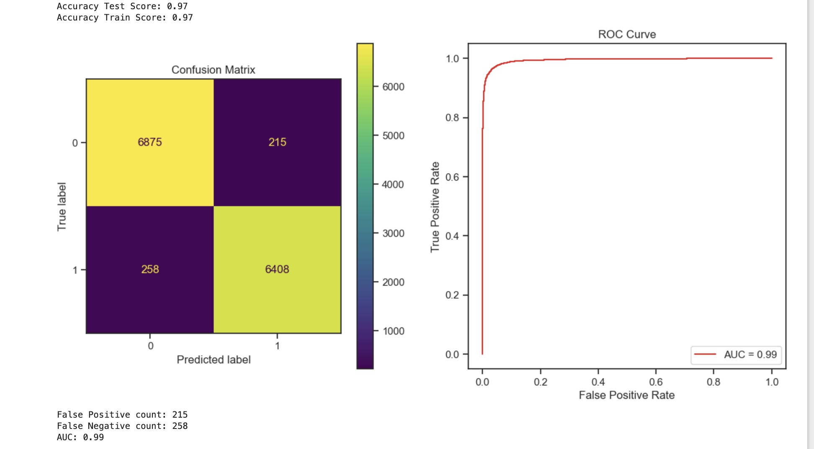
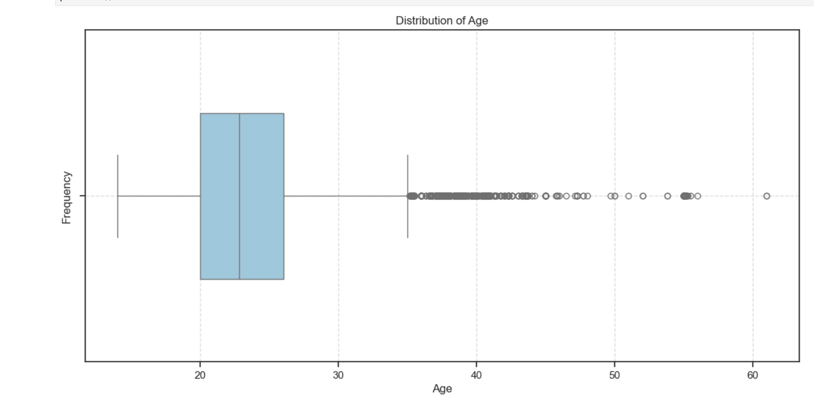

### Predicting Cardiovascular Disease and Obesity Risk Using Machine Learning

**Author:** Aparna Pillai

#### Executive Summary

This project aims to develop a machine learning model capable of predicting an individual's risk of cardiovascular disease (CVD) or obesity. By leveraging lifestyle, demographic, and clinical factors, we aim to identify high-risk individuals, enabling early interventions and preventive measures.

#### Rationale

Cardiovascular diseases and obesity pose a significant global health burden, leading to increased morbidity, mortality, and healthcare costs. Early identification of at-risk individuals is crucial for effective prevention and treatment strategies. This project addresses this need by developing a predictive model that can assist healthcare professionals in personalized risk assessment and targeted interventions.

#### Research Question

What is the likelihood that an individual will develop cardiovascular disease or obesity based on their lifestyle, demographic, and clinical factors?

#### Data Sources

* **Dataset:** [https://www.kaggle.com/competitions/playground-series-s4e2/overview](https://www.kaggle.com/competitions/playground-series-s4e2/overview)
* **Features:**
    * Demographics: Age, gender, ethnicity, socioeconomic status
    * Clinical Measurements: Blood pressure, cholesterol levels, glucose levels, BMI, etc.
    * Lifestyle Factors: Physical activity levels, diet, smoking status, alcohol consumption, etc.
    * Health Outcomes: Labels indicating obesity, cardiovascular disease, or related conditions

#### Methodology

* **Data Preprocessing:** Handling missing values, outliers, normalization, and one-hot encoding
* **Feature Engineering:** Deriving BMI categories, hypertension levels, physical activity indexes, and creating interaction terms
* **Model Selection:** Initial implementation of Logistic Regression
* **Train-Test Split:** Stratified splitting to address imbalanced data
* **Evaluation:** Accuracy, precision, recall, F1-score, ROC curves (planned)
* **Feature Importance Analysis & Model Interpretability:** Techniques to understand model predictions and key factors (planned)

#### Results

* **Initial Model (Logistic Regression):** [Provide performance metrics if available]
* **Data Insights:**
    * Age distribution is right-skewed (more younger individuals)
    * Target variable transformed into binary (obese/non-obese) with a 51.5% to 48.5% split

#### Next Steps

* Explore additional machine learning models (Random Forest, SVM, etc.)
* Hyperparameter tuning
* Comprehensive model evaluation
* Feature importance analysis
* Model interpretability techniques

#### Outline of project

* [Link to notebook 1]() - Data Exploration & Preprocessing
* [Link to notebook 2]() - Model Building & Evaluation TBD
* [Link to notebook 3]() - Feature Importance & Interpretability TBD

