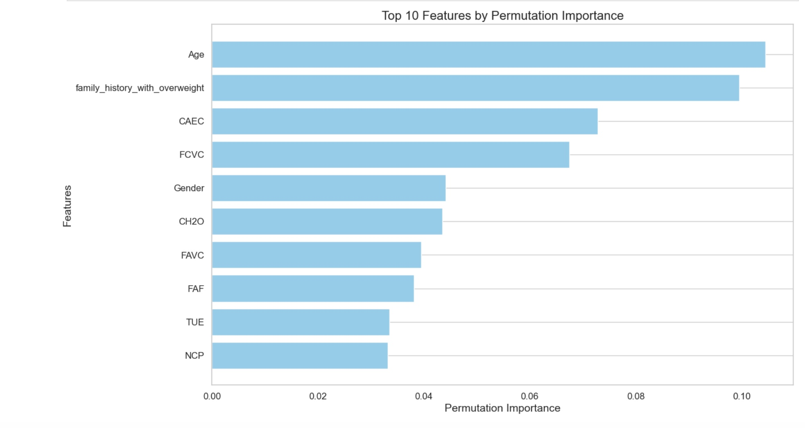

### Predicting Cardiovascular Disease and Obesity Risk Using Machine Learning

**Author:** Aparna Pillai

#### Executive Summary

This project aims to develop a machine learning model capable of predicting an individual's risk of cardiovascular disease (CVD) or obesity. By leveraging lifestyle, demographic, and clinical factors, we aim to identify high-risk individuals, enabling early interventions and preventive measures.

#### Rationale

Cardiovascular diseases and obesity pose a significant global health burden, leading to increased morbidity, mortality, and healthcare costs. Early identification of at-risk individuals is crucial for effective prevention and treatment strategies. This project addresses this need by developing a predictive model that can assist healthcare professionals in personalized risk assessment and targeted interventions.

#### Research Question

What is the likelihood that an individual will develop cardiovascular disease or obesity based on their lifestyle, demographic, and clinical factors?

#### Data Sources

* **Dataset:** [https://www.kaggle.com/competitions/playground-series-s4e2/overview](https://www.kaggle.com/competitions/playground-series-s4e2/overview)
* **Features:**
    * Demographics: Age, gender, ethnicity, socioeconomic status
    * Clinical Measurements: Blood pressure, cholesterol levels, glucose levels, BMI, etc.
    * Lifestyle Factors: Physical activity levels, diet, smoking status, alcohol consumption, etc.
    * Health Outcomes: Labels indicating obesity, cardiovascular disease, or related conditions

#### Methodology

* **Data Preprocessing:** Handling missing values, outliers, normalization, and one-hot encoding
* **Feature Engineering:** Deriving BMI categories, hypertension levels, physical activity indexes, and creating interaction terms
* **Model Selection:** Initial implementation of Logistic Regression
* **Train-Test Split:** Stratified splitting to address imbalanced data
* **Evaluation:** Accuracy, precision, recall, F1-score, ROC curves (planned)
* **Feature Importance Analysis & Model Interpretability:** Techniques to understand model predictions and key factors (planned)

#### Results

* **Initial Model (Logistic Regression):** [Provide performance metrics if available]
* **Data Insights:**
    * Age distribution is right-skewed (more younger individuals)
    * Target variable transformed into binary (obese/non-obese) with a 51.5% to 48.5% split

#### Next Steps

* Explore additional machine learning models (Random Forest, SVM, etc.)
* Hyperparameter tuning
* Comprehensive model evaluation
* Feature importance analysis
* Model interpretability techniques

#### Outline of project

* [Link to notebook 1](https://github.com/AparnaPillai46/Obesity_Risk_Analysis/blob/main/ObesityRiskAnalysis_Data%20Exploration.ipynb) - Data Exploration & Preprocessing
* [Link to notebook 2](https://github.com/AparnaPillai46/Obesity_Risk_Analysis/blob/main/ObesityRiskAnalysis.ipynb) - Model Building & Evaluation & Summary

#### Key Takeaways:
Influence of Family History: Family history is identified as the most significant predictor of obesity. This underscores the importance of genetic and environmental factors that may predispose individuals to higher obesity risk.

Impact of Age: Age is the second most important predictor. This suggests that as individuals age, their risk for obesity may change, potentially due to metabolic shifts and lifestyle changes over time.

Interconnectedness of Factors: Both family history and age likely influence lifestyle factors, including eating habits and physical activity levels. Understanding this relationship can enhance the model’s predictive power.

Eating Habits as Predictors: Consumption patterns, such as the frequency of eating between meals and the intake of vegetables, are significant predictors of obesity. These factors highlight the role of dietary choices in obesity risk.

Physical Attributes vs. Behavioral Factors: The analysis indicates that behavioral factors, particularly family history and eating habits, serve as stronger predictors of obesity compared to physical attributes. This points to the need for a holistic approach in obesity prevention strategies.

Recommendations for Further Exploration: Detailed Feature Exploration: Investigate the possibility of decomposing the factors of family history and age into more specific, actionable features. The current analysis suggests that existing data may not fully capture the nuances of these predictors, indicating opportunities for deeper insights.

Tailored Health and Nutritional Interventions: Develop targeted health and nutritional programs that leverage the predictive factors identified in this analysis. These interventions should aim to mitigate obesity risk by addressing the key lifestyle influences highlighted by the model.

Broaden the Scope of Analysis: Consider including additional variables related to socio-economic status, education, and access to healthcare in future analyses. This broader perspective may yield further insights into the complex interplay of factors contributing to obesity.
